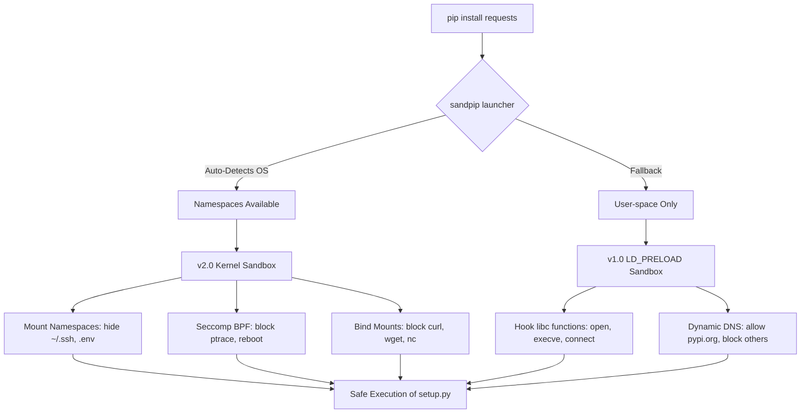

<p align="center">
  
</p>

# SandPip

[](https://github.com/YOUR_GITHUB_USERNAME/sandpip/actions/workflows/test.yml)
[](https://opensource.org/licenses/MIT)

SandPip is a lightweight, secure sandbox for risky package-manager install scripts (such as `setup.py` in pip or `postinstall` in npm). 

It prevents malicious scripts from stealing credentials, spawning reverse shells, or making unauthorized network requests during package installation.

---

## Architecture & How It Works

SandPip supports two levels of sandboxing depending on your security needs, wrapped in a single smart command:



| Command | Action | Isolation Technology | Targets Blocked | Strengths |
| :--- | :--- | :--- | :--- | :--- |
| **`sandpip`** (or **`spip`**) | **Auto-Detect (Default)** | Detects OS features and runs the best available version (v2.0 ➔ v1.0 ➔ Audit Mode). | Dynamic selection | Zero-configuration. Works out of the box on any Linux environment. |
| `sandpip_v2` (or `spip2`) | **Force v2.0** | **Namespaces + Seccomp** | SSH/Cloud folders, ptrace, curl/wget execution | **Kernel-level protection**. Prevents escapes via static binaries or direct assembler syscalls. |
| `sandpip_v1` (or `spip1`) | **Force v1.0** | `LD_PRELOAD` Hooking | Files, sockets, execs | Lightweight, runs in user-space, dynamic DNS registry allowlist. |

---

## Installation

Install SandPip directly from GitHub using `pip`:

```bash
pip install git+https://github.com/YOUR_GITHUB_USERNAME/sandpip.git
```

This compiles the C components automatically and registers four global commands: `sandpip`, `sandpip_v2`, `spip`, and `spip2`.

> [!NOTE]
> Compilation requires a C compiler (such as `gcc`) installed on your Linux system.

---

## Usage

### 1. Standard Usage (Recommended)
Simply prefix your standard `pip install` commands with `spip` (or `sandpip`):

```bash
spip install some-package
```

The script will automatically detect your kernel configuration:
- If User Namespaces are enabled ➔ It launches the robust **v2.0 Kernel Sandbox**.
- If Namespaces are blocked ➔ It gracefully falls back to the **v1.0 User-space Sandbox** (LD_PRELOAD).
- If no sandbox is available ➔ It runs in **Audit/Warn Mode** (raw execution with a security warning).

### 2. Strict Kernel Isolation
To bypass auto-detection and force the system-level Namespaces + Seccomp sandbox:

```bash
spip2 install some-package
```

### 3. Lightweight User-space Isolation
To force the `LD_PRELOAD` sandbox:

```bash
spip1 install some-package
```

### Advanced Options

* **Allow a custom registry domain**:
  ```bash
  SANDPIP_ALLOWED_DOMAINS="packages.example.com" spip install some-package
  ```
* **Allow a raw IP address**:
  ```bash
  SANDPIP_ALLOWED_IPS="1.2.3.4" spip install some-package
  ```

---

## Security Features in Detail

### 1. File Access Protection
* **v1.0 (LD_PRELOAD)**: Hooks `open`, `openat`, `openat2` and blocks access to sensitive paths (like `~/.ssh/`, `~/.aws/`, `.env` files).
* **v2.0 (Namespaces)**: Uses **Mount Namespaces** to mount a clean `tmpfs` over sensitive directories (`~/.ssh`, `~/.aws`, `~/.gcp`, `~/.kube`) and bind mounts `/dev/null` over `.env` files. Inside the sandbox, these files physically do not exist.

### 2. Process Execution Protection
* **v1.0 (LD_PRELOAD)**: Hooks `execve` to block shell utilities (`curl`, `wget`, `netcat`, interactive `bash`/`sh`).
* **v2.0 (Namespaces)**: Bind mounts `/dev/null` over system binaries (`/usr/bin/curl`, `/usr/bin/wget`, `/usr/bin/nc`, etc.). Even static binaries cannot spawn these utilities.

### 3. Kernel hardening (v2.0)
* Applies a **Seccomp-BPF** filter that blocks `ptrace` (preventing process memory injection), `reboot`, `syslog`, and `kexec_load` at the kernel level with `EPERM`.

---

## Local Development & Testing

Use the provided `Makefile` to compile or run test suites locally.

### Compile
```bash
make
```

### Run Tests
```bash
make test        # Runs v1.0 file/process validation tests
make test-network # Runs v1.0 dynamic DNS registry allowlist tests
make test-v2     # Runs v2.0 kernel namespaces and seccomp validation tests
```

### Clean
```bash
make clean
```
